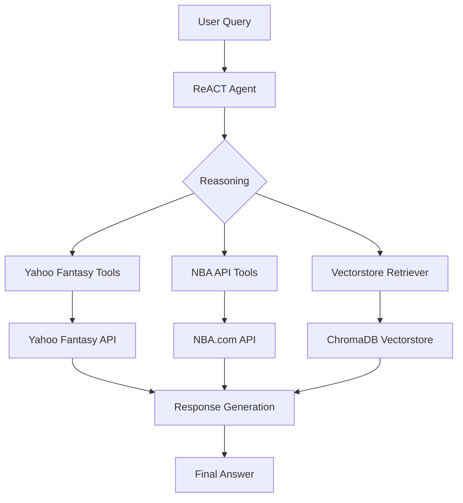

# ClutchAI 🧠🏈  
**AI-powered fantasy sports assistant built with Retrieval-Augmented Generation (RAG)**  

ClutchAI connects to the **Yahoo Fantasy Sports API** to give you real-time, context-aware answers about your fantasy league — powered by LLMs and vector-based retrieval.  

## 🚀 Features
- **Yahoo Fantasy Integration:** Securely connect your league, team, and player data via OAuth.  
- **Natural Language Q&A:** Ask questions like *“Who should I start at FLEX this week?”* or *“How did my matchup go?”*  
- **Contextual Intelligence:** Uses a RAG system to ground responses in your actual league data.  
- **Structured + Semantic Retrieval:** Combines factual data (scores, rosters) with contextual summaries (player notes, matchups).  
- **Explainable Insights:** Every answer includes source context from your league.  

## 🧩 Tech Stack
- **Frontend:** Streamlit  
- **Data Source:** Yahoo Fantasy Sports API  
- **LLM Layer:** OpenAI (GPT-4)  
- **Vector Store:** ChromaDB (local)  
- **RAG System:** LangChain with OpenAI embeddings 

## ⚙️ Setup

1. **Clone the repo**
   ```bash
   git clone https://github.com/yourusername/clutchai.git
   cd clutchai
   ```

2. **Install dependencies**
   ```bash
   pip install -r requirements.txt
   ```

3. **Configure environment variables**
   ```bash
   cp env.example .env
   ```
   
   Edit `.env` and add your credentials:
   ```bash
   YAHOO_CLIENT_ID=your_yahoo_client_id
   YAHOO_CLIENT_SECRET=your_yahoo_client_secret
   OPENAI_API_KEY=your_openai_api_key
   YAHOO_LEAGUE_ID=your_league_id  # Optional, defaults to 58930
   ```

4. **Run the Streamlit app**
   ```bash
   streamlit run app/streamlit_app.py
   ```
   
   The app will open in your browser at `http://localhost:8501`

## 📚 Documentation

For detailed setup instructions, see:
- **[Yahoo API Setup](docs/YAHOO_API_SETUP_GUIDE.md)** - How to get Yahoo Fantasy API credentials
- **[ChromaDB Setup](docs/CHROMADB_SETUP.md)** - Vector database configuration
- **[Vectorstore Management](docs/VECTORSTORE_MANAGEMENT.md)** - Adding YouTube videos and articles to your knowledge base

## 💬 Example Queries
- "Show my team’s performance from last week."
- "Who are the top waiver pickups this week?"
- "Compare my RBs to the league average."
- "Should I start Joe Mixon or Austin Ekeler?"

## 🧠 How It Works

1. **Data Retrieval**: Pulls league + team data via Yahoo Fantasy Sports API
2. **Knowledge Base**: Stores YouTube videos and articles in ChromaDB vectorstore for context
3. **Embedding**: Converts textual content into vector embeddings using OpenAI
4. **RAG Pipeline**: On query, retrieves relevant context from vectorstore and augments the LLM prompt
5. **Response Generation**: LLM generates grounded, explainable insights using both league data and knowledge base

## 🤖 ReACT Framework & Tools

ClutchAI uses the **ReACT (Reasoning + Acting)** framework, which enables the agent to reason about user queries and take actions by calling specialized tools. The agent can dynamically decide which tools to use based on the query context.

### Architecture



### Available Agent Tools

| Name | Data Type | Implementation |
|------|-----------|----------------|
| Yahoo Fantasy Tools (45) | Live data | API Tool |
| NBA API - Player/Team Stats | Live data | API Tool |
| NBA API - Game Data | Live data | API Tool |
| NBA API - Static Data | Static data | API Tool |
| YouTube Transcripts | Static data | VectorDB |
| Articles | Static data | VectorDB |

**Tool Categories:**
- **Yahoo Fantasy Tools**: League info, standings, rosters, matchups, player stats, transactions
- **NBA API Tools**: Player stats, team stats, game scores, box scores, play-by-play
- **Vectorstore Retriever**: Semantic search over YouTube transcripts and articles

## 🔒 Security

- API keys are stored locally in `.env` file (never committed to git)
- Yahoo OAuth tokens are managed securely by the yfpy library
- Private league data is never shared outside your account
- Vectorstore data is stored locally in `ClutchAI/rag/chroma_db/`

## 🎯 Getting Started

1. Set up your Yahoo API credentials (see [Yahoo API Setup Guide](docs/YAHOO_API_SETUP_GUIDE.md))
2. Configure your OpenAI API key
3. Run the Streamlit app: `streamlit run app/streamlit_app.py`
4. Enter your credentials in the app sidebar
5. Start asking questions about your fantasy league!

The app will automatically initialize the vectorstore and load resources from `ClutchAI/rag/vectordata.yaml` on first run.
 
