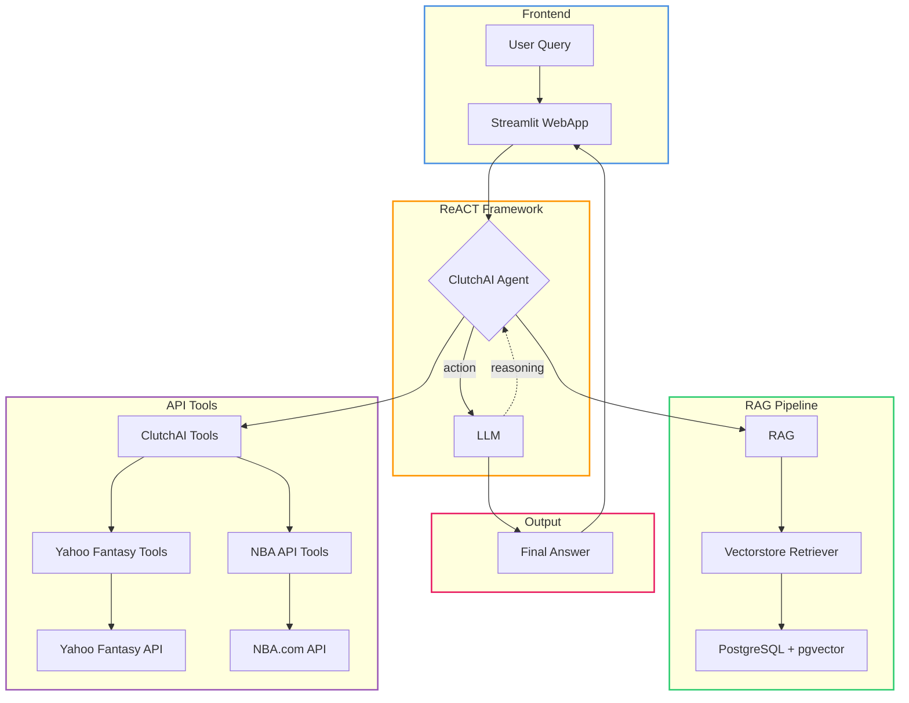
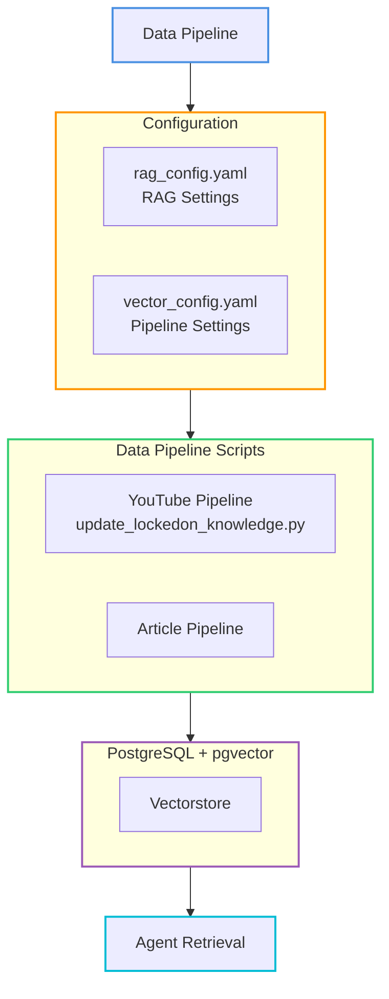

# ClutchAI 🧠🏈  
**AI-powered fantasy sports assistant built with Retrieval-Augmented Generation (RAG)**  

ClutchAI connects to the **Yahoo Fantasy Sports API** to give you real-time, context-aware answers about your fantasy league — powered by LLMs and vector-based retrieval.  

## 🚀 Features
- **Yahoo Fantasy Integration:** Securely connect your league, team, and player data via OAuth.  
- **Natural Language Q&A:** Ask questions like *“Who should I start at FLEX this week?”* or *“How did my matchup go?”*  
- **Contextual Intelligence:** Uses a RAG system to ground responses in your actual league data.  
- **Structured + Semantic Retrieval:** Combines factual data (scores, rosters) with contextual summaries (player notes, matchups).  
- **Explainable Insights:** Every answer includes source context from your league.  

## 🧩 Tech Stack
- **Frontend:** Streamlit  
- **Data Source:** Yahoo Fantasy Sports API  
- **LLM Layer:** OpenAI (GPT-4)  
- **Vector Store:** PostgreSQL with pgvector (Google Cloud SQL)  
- **RAG System:** LangChain with OpenAI embeddings 

## ⚙️ Setup

1. **Clone the repo**
   ```bash
   git clone https://github.com/yourusername/clutchai.git
   cd clutchai
   ```

2. **Install dependencies**
   ```bash
   pip install -r requirements.txt
   ```

3. **Configure environment variables**
   ```bash
   cp env.example .env
   ```
   
   Edit `.env` and add your credentials:
   ```bash
   # Yahoo Fantasy API
   YAHOO_CLIENT_ID=your_yahoo_client_id
   YAHOO_CLIENT_SECRET=your_yahoo_client_secret
   YAHOO_LEAGUE_ID=your_league_id  # Optional, defaults to 58930
   
   # OpenAI
   OPENAI_API_KEY=your_openai_api_key
   
   # Google Cloud SQL (PostgreSQL with pgvector)
   GOOGLE_CLOUD_PROJECT_ID=your_project_id
   GOOGLE_CLOUD_REGION=your_region
   GOOGLE_CLOUD_INSTANCE=your_instance_name
   GOOGLE_CLOUD_DATABASE=your_database_name
   GOOGLE_CLOUD_USER=your_db_user
   GOOGLE_CLOUD_PASSWORD=your_db_password
   CLOUDSQL_VECTOR_TABLE=your_vector_table_name  # Optional, defaults to 'vectorstore'
   
   # Optional: YouTube Data API (for video metadata)
   GOOGLE_CLOUD_KEY=your_google_cloud_api_key
   ```

4. **Run the Streamlit app**
   ```bash
   streamlit run app/streamlit_app.py
   ```
   
   The app will open in your browser at `http://localhost:8501`

## 📚 Documentation

For detailed setup instructions, see:
- **[Yahoo API Setup](docs/YAHOO_API_SETUP_GUIDE.md)** - How to get Yahoo Fantasy API credentials
- **[PostgreSQL/pgvector Setup](docs/POSTGRESQL_SETUP.md)** - Vector database configuration (Google Cloud SQL)
- **[Vectorstore Management](docs/VECTORSTORE_MANAGEMENT.md)** - Adding YouTube videos and articles to your knowledge base
- **[Configuration Files](docs/CONFIGURATION.md)** - RAG and vector manager configuration

## 💬 Example Queries
- "Show my team’s performance from last week."
- "Who are the top waiver pickups this week?"
- "Compare my RBs to the league average."
- "Should I start Joe Mixon or Austin Ekeler?"

## 🧠 How It Works

1. **Data Retrieval**: Pulls league + team data via Yahoo Fantasy Sports API
2. **Knowledge Base**: Stores YouTube videos and articles in PostgreSQL vectorstore (pgvector) for context
3. **Embedding**: Converts textual content into vector embeddings using OpenAI
4. **RAG Pipeline**: On query, retrieves relevant context from vectorstore and augments the LLM prompt
5. **Response Generation**: LLM generates grounded, explainable insights using both league data and knowledge base

## 🤖 ReACT Framework & Tools

ClutchAI uses the **ReACT (Reasoning + Acting)** framework, which enables the agent to reason about user queries and take actions by calling specialized tools. The agent can dynamically decide which tools to use based on the query context.

### Architecture




### VectorDB Data Pipeline

The vectorstore is managed through dedicated pipeline scripts and configuration files:



**Pipeline Features:**
- **YouTube Videos**: Process podcast transcripts with configurable chunk sizes, delays, and batch limits
- **Articles**: Scrape and ingest articles from various sources
- **Configuration**: Centralized config files for RAG settings (`rag_config.yaml`) and pipeline settings (`vector_config.yaml`)
- **Rate Limiting**: Built-in delays and retry logic to handle YouTube IP blocking

### Available Agent Tools

| Name | Data Type | Implementation |
|------|-----------|----------------|
| Yahoo Fantasy Tools (45) | Live data | API Tool |
| NBA API (16) | Live data | API Tool |
| LockedOn Podcast Transcripts | Static data | RAG |
| Articles | Static data | RAG |

**Tool Categories:**
- **Yahoo Fantasy Tools**: League info, standings, rosters, matchups, player stats, transactions
- **NBA API Tools**: Player stats, team stats, game scores, box scores, play-by-play
- **Vectorstore Retriever**: Semantic search over YouTube transcripts and articles

## 🔒 Security

- API keys are stored locally in `.env` file (never committed to git)
- Yahoo OAuth tokens are managed securely by the yfpy library
- Private league data is never shared outside your account
- Vectorstore data is stored securely in Google Cloud SQL (PostgreSQL)
- Database credentials are managed through environment variables
- Cloud SQL connections use secure authentication via Cloud SQL Connector

## 🎯 Getting Started

1. **Set up your Yahoo API credentials** (see [Yahoo API Setup Guide](docs/YAHOO_API_SETUP_GUIDE.md))
2. **Configure your OpenAI API key** in `.env`
3. **Set up Google Cloud SQL** with PostgreSQL and pgvector extension (see [PostgreSQL Setup](docs/POSTGRESQL_SETUP.md))
4. **Configure database credentials** in `.env` file
5. **Run the Streamlit app**: `streamlit run app/streamlit_app.py`
6. **Enter your credentials** in the app sidebar
7. **Start asking questions** about your fantasy league!

### Adding Knowledge Base Content

To add YouTube videos and articles to your knowledge base:

1. **Configure settings** in `data/cloud_sql/vector_managers/vector_config.yaml`:
   ```yaml
   youtube_channel:
     max_videos: 10  # Process 10 most recent videos per run
     delay_between_videos: 12.0  # Delay to avoid rate limiting
   ```

2. **Run the YouTube pipeline**:
   ```bash
   python scripts/vectordb_pipelines/update_lockedon_knowledge.py
   ```

3. **Customize RAG settings** in `agents/rag/rag_config.yaml`:
   ```yaml
   youtube:
     chunk_size_seconds: 30  # Transcript chunk size
   vectorstore:
     k: 4  # Number of documents to retrieve
   retrieval:
     search_type: "similarity"  # or "mmr"
   ```

The agent will automatically use the configured settings when retrieving context from the vectorstore.
 
